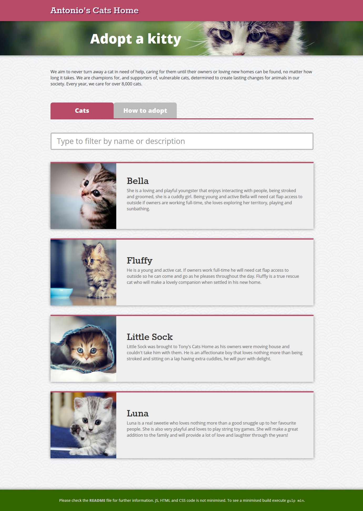
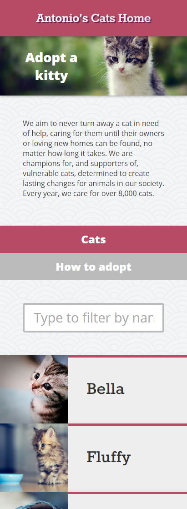

## Antonio's Cats Home

. 


Antonio's Cats Home is a skills' demonstration exercise where I implement the same web project with three different front-end technologies:
- [Vanilla ES5 JavaScript](https://antonioredondo.github.io/AntoniosCatsHome/vanillaJavaScript/README.htm) ([source code](https://github.com/AntonioRedondo/AntoniosCatsHome/tree/master/vanillaJavaScript)): no dependencies, tiny size, pure functions, functional programming.
- [AngularJS 1.6](https://antonioredondo.github.io/AntoniosCatsHome/angularJS/README.htm) ([source code](https://github.com/AntonioRedondo/AntoniosCatsHome/tree/master/angularJS)): services, directives, isolated scopes, [UI-Router](https://www.npmjs.com/package/angular-ui-router) and [ngAnimate](https://docs.angularjs.org/api/ngAnimate).
- [React 16.2](https://antonioredondo.github.io/AntoniosCatsHome/react/README.htm) ([source code](https://github.com/AntonioRedondo/AntoniosCatsHome/tree/master/react)): Redux, React Router, [styled-components](https://www.styled-components.com/) and server-side rendering.

Visually the implementations are identical. Under the hood there are important differences. These implementations solve common front-end problems like model/scope/state creation, routing and animations based on component entering/leaving states. All three implementations are Single-page Applications (SPAs). They have been developed following a TDD approach.

This project is intended to help recruiters and hiring IT managers when time comes to assess my coding skills.


### Exercise statement

The starting point is the below mockup:


Given I am only provided with the above mockup representing a common use case, four images of cats and a JSON file containing a list of cat names and descriptions:

- A web GUI has to be implemented to show a list of cats which are available for adopting from the local cats shelter "Antonio's Cats Home".

- The interface must contain an input text field that when typing on it it will filter cats' cards out.

- On the JSON feed the cats won't be ordered by name, but when shown on screen they will need to be sorted alphabetically.

- A card at a time can be selected. There must be some visual hint to distinguish the selected card.

- The GUI must be also responsive and adapt to mobile devices. An attractive design is a plus.


### Comparison between implementations

On the below table you can see technical differences between implementations (SCROLL RIGHT TO SEE THE REST OF THE TABLE):


Implementation | JS (Kb minified) | CSS (Kb minified) | JS imports | CSS imports | Front-end framework | HTTP requests | Routing | Transitions | Other relevant libraries | CSS framework | Building tools | Linting | Tests | Server-side rendering | Server | Readme file | Ready out of the box
--- | --- | --- | --- | --- | --- | --- | --- | --- | --- | --- | --- | --- | --- | --- | --- | --- | ---
Vanilla ES5 JavaScript | 2 | 5 | 1 | 1 (plus fonts) | - (HTML strings with [`insertAdjacentHTML`](https://developer.mozilla.org/en-US/docs/Web/API/Element/insertAdjacentHTML)) | XMLHttpRequest | - | - | - | Less using [BEM](http://getbem.com/naming) | npm, Gulp | [JSHint](https://www.npmjs.com/package/gulp-jshint), [HTMLLint](https://www.npmjs.com/package/gulp-htmllint), [lesshint](https://www.npmjs.com/package/lesshint) | Jasmine and Karma on PhantomJS | :x: | Node.js | [HTML](https://antonioredondo.github.io/AntoniosCatsHome/vanillaJavaScript/README.htm) | On [`dist`](vanillaJavaScript/dist) folder
AngularJS | 222 | 5 | 1 | 1 (plus fonts) | AngularJS 1.6 (directive) | [$http](https://docs.angularjs.org/api/ng/service/$http) | [UI-Router](https://www.npmjs.com/package/angular-ui-router) | [ngAnimate](https://docs.angularjs.org/api/ngAnimate) | - | Less using BEM | npm, Gulp | JSHint, HTMLLint, lesshint | Jasmine and Karma on PhantomJS | :x: | Node.js | [HTML](https://antonioredondo.github.io/AntoniosCatsHome/angularJS/README.htm) | On [`dist`](angularJS/dist) folder
React | 250 | 3 | 1 | 1 (plus fonts) | React 16.2 | [Axios](https://www.npmjs.com/package/axios) | [React Router](https://www.npmjs.com/package/react-router) | [ReactTransitionGroup](https://www.npmjs.com/package/react-transition-group) | Redux, Reselect | [styled-components](https://www.npmjs.com/package/styled-components) and PostCSS using BEM | npm, Gulp, Rollup | [ESLint](https://www.npmjs.com/package/gulp-eslint), [stylelint](https://stylelint.io) | Jest on Node.js | :heavy_check_mark: | Node.js | [HTML](https://antonioredondo.github.io/AntoniosCatsHome/react/README.htm) | On [`dist`](react/dist) folder


### How to best understand my skills with the test

There are a few points where attention can be paid to find out how good the exercise is and therefore to assess my programming skills. The implementations contain a set of general technologies, software patterns and best practices normally used on front-end software development.

We can check:
- **Code simplicity:** there must be a balance between the number of technologies used to showcase skills and the real need and number of requirements in order to avoid feature overload. The balance pursued is quality over quantity. A couple of features well implemented counts more than five features poorly implemented ([KISS principle](https://en.wikipedia.org/wiki/KISS_principle])). On the test statement there are no explicit instructions about libraries or features to be used. This gives freedom of choice at the same time interviewers have less scripted results.
- **Front-end framework:** when using a front-end framework like Angular or React I try to do the best use of these frameworks. Every of these front-end frameworks are a world by themselves and getting used to its opinionated patterns, component life cycles and complex APIs has a learning curve. A pure JavaScript approach shows how basics are not forgotten.
- **Animations:** CSS animations is a must-have in modern front-end development. They add interface continuity and provide extra feedback to the user about the expected behaviour of the GUI. There are three basic ways animations can be added to HTML elements: with CSS transitions, with CSS key frames and with JavaScript by changing element properties. A not so good way to add animations would be using a library like [`jQuery.animate()`](http://api.jquery.com/animate). In a test like this a bad way to animate elements would be using CSS key frames.
- **Folder structure:** a folder structure organises files in a way it is easy to find files as the project grows in size. Often front-end libraries have its own folder structure guidelines. For Angular [this](http://stackoverflow.com/questions/18542353/angularjs-folder-structure) is a good guideline. A general approach would be the below one. Source code must be separated from distributable/built code.
```
    root
      dist
      src
        assets
          images
          fonts
        components
        data
        style
      tests
```
- **`Readme` file:** a readme file with explanations and instructions must be always present in the root folder. A lack of this file makes harder for interviewers to understand a candidate test.
- **Technical tricks and traps:** on the tests the code will provide tips about the candidate seniority level:
  - Conversion of SVG images to png: common mistake. There is no need to convert SVG to png. Even old versions of Internet Explorer support SVG. Doing so the vectorial nature of SVG is lost.
  - Many CSS and/or JavaScript imports: increases number of HTTP calls and page weight affecting execution performance and loading time.
  - Lack of use of semantic HTML elements: in addition to `<div>`s and `<span>`s, elements like `<header>`, `<footer>`, `<section>`, or `<article>` should be used.
  - Many temporarary/unneeded files created with a boilerplate project: the use of a generator or a reference project is a good starting base as long as the rest of not used files are removed and the files used are cleaned out from unused code.


### Extra information

Don't forget to have a look at the rest of my GitHub repo. My website is always open for business on [antonioredondo.com](http://antonioredondo.com). And its source code is available on [GitHub](https://github.com/AntonioRedondo/antonioredondo.com-v3). A good place to learn about my coding skills.
